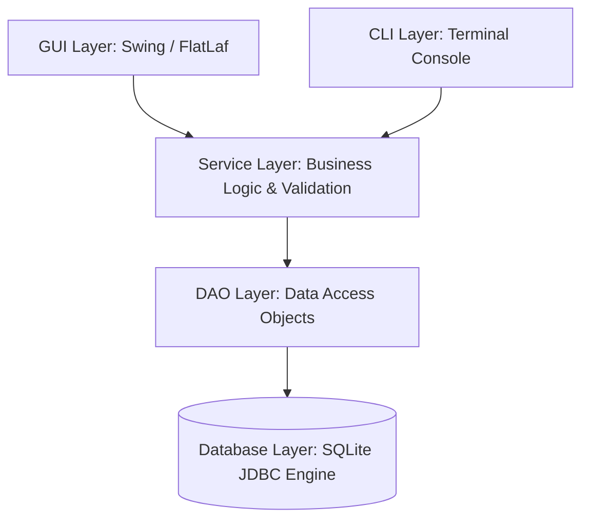
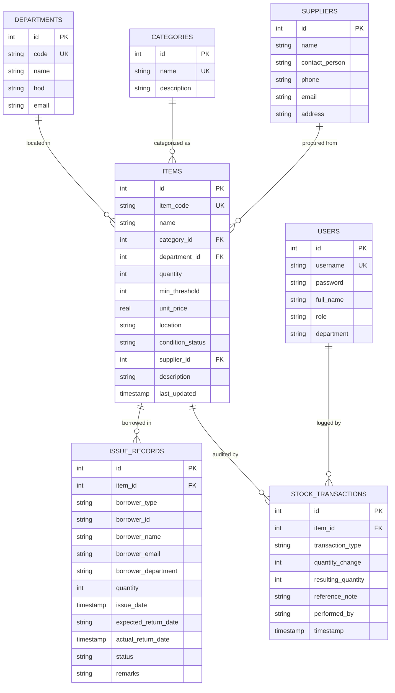

# 🎓 CampusAsset Pro - College Inventory & Equipment Management System

> A robust, database-driven Java desktop and console application designed specifically for colleges, universities, and academic institutions to manage laboratory equipment, campus computers, chemical consumables, faculty/student equipment loans, and inventory audits.

---

## 📌 Table of Contents
1. [⚡ Quick Start: How to Run in 5 Seconds](#-quick-start-how-to-run-in-5-seconds)
2. [Project Overview](#-project-overview)
3. [Key Features](#-key-features)
4. [System Architecture](#-system-architecture)
5. [Database Schema & ER Diagram](#-database-schema--er-diagram)
6. [Project Structure](#-project-structure)
7. [Detailed Explanation of Modules & Functions](#-detailed-explanation-of-modules--functions)
8. [Default User Credentials](#-default-user-credentials)
9. [🚀 Complete Execution Guide (Windows / Linux / IDEs)](#-complete-execution-guide-windows--linux--ides)
10. [Troubleshooting & FAQs](#-troubleshooting--faqs)
11. [Step-by-Step Workflow Scenarios](#-step-by-step-workflow-scenarios)
12. [Reports & Exports](#-reports--exports)

---

## ⚡ Quick Start: How to Run in 5 Seconds

If you have Java (JDK 17 or 21+) installed, you can launch the project immediately!

### 💻 On Windows:
- **To Launch the Modern Desktop GUI**:
  Double-click **`run.bat`** in File Explorer, or run in terminal:
  - Command Prompt: `run.bat`
  - PowerShell: `.\run.bat` or `.\run.ps1`
- **To Launch in Terminal / Console (CLI) Mode**:
  Double-click **`run_cli.bat`** in File Explorer, or run in terminal:
  - Command Prompt: `run_cli.bat`
  - PowerShell: `.\run_cli.bat` or `.\run_cli.ps1`
- **To Recompile Source Code**:
  Double-click **`build.bat`**, or run `build.bat` (PowerShell: `.\build.bat`).

> **Note**: `run.bat` and `run_cli.bat` automatically detect if the project is compiled, and will run `build.bat` for you on first launch!

### 🐧 On Linux / macOS:
```bash
chmod +x *.sh
./run.sh        # Runs the Desktop GUI
./run_cli.sh    # Runs the Terminal CLI
```

### 🔑 Login Credentials to Sign In:
- **Username**: `admin`
- **Password**: `admin123`

---

## 🌟 Project Overview

Colleges and universities manage thousands of valuable physical assets spread across various academic departments, research labs, workshops, sports complexes, and libraries. Traditional manual register books lead to misplaced equipment, untracked damage, overdue student loans, and audit compliance issues.

**CampusAsset Pro** solves this by offering an enterprise-grade, **SQLite database-driven inventory management system** built using clean layered architecture in Java. It features:
- A **Modern Desktop Graphical User Interface (Swing with FlatLaf styling)**.
- A **Full Interactive Terminal Console Interface (CLI)** for headless or quick command-prompt usage.
- An embedded zero-configuration SQLite database with pre-populated realistic college data.
- Built-in transaction logging, automated stock updates, and one-click CSV report export.

---

## ⚡ Key Features

1. **Centralized Asset Catalog**:
   - Categorizes equipment across Computer Labs, Electronics Labs, Chemistry Warehouses, Mechanical Workshops, Central Library, and Sports Departments.
   - Tracks unique Asset Codes (SKU), physical locations (Room/Rack/Workbench), unit prices, and operating condition (*Working*, *Under Maintenance*, *Damaged*, *Scrapped*).

2. **Automated Stock Tracking & Low-Stock Alerts**:
   - Configurable minimum safety stock threshold per item.
   - Visual red/amber warning badges on the dashboard when critical consumables or equipment fall below threshold.

3. **Issue & Return Desk (Borrowing Management)**:
   - Issue equipment to **Students** (using Roll Number) or **Faculty/Staff** (using Employee ID).
   - Set expected return dates with project/purpose remarks.
   - One-click return processing: automatically increments stock back into inventory, records condition remarks, and updates loan records.

4. **Multi-Action Stock Adjustments**:
   - Restock / Receive new purchase shipments (`STOCK_IN`).
   - Write off broken or decommissioned lab gear (`SCRAP`).
   - Audit reconciliation / manual inventory count corrections (`ADJUSTMENT`).

5. **Complete Audit Ledger & Accountability Trail**:
   - Every single stock increase or decrease is logged with an immutable audit entry containing action type, quantity change (+/-), resulting balance, staff name, reference reason, and timestamp.

6. **Vendor & Supplier Directory**:
   - Maintain supplier contact details, company names, emails, phone numbers, and physical addresses.

7. **Academic Departments & Specialized Labs**:
   - Department directory tracking Department Code, Department Name, Head of Department (HOD), and contact email.

8. **Asset Valuation & Financial Analytics**:
   - Live dashboard cards displaying total units in stock, unique catalog items, total valuation in Indian Rupees (INR ₹), and active loans.
   - Department-wise breakdown of total assets and valuation.

9. **One-Click CSV Export**:
   - Export full Inventory Master Sheet, Equipment Loan Records, and Audit Logs to standard CSV files compatible with Microsoft Excel and Google Sheets.

---

## 🏗 System Architecture

The application is structured following the **Layered Architectural Pattern** with strict separation of concerns:



### Layer Breakdown:
1. **Presentation Layer (`com.college.inventory.ui` & `cli`)**:
   - Provides user interactions, forms, validation messages, tables, and dashboards.
2. **Service Layer (`com.college.inventory.service`)**:
   - Houses business logic, stock sufficiency validation, atomic stock decrement/increment on issue and return, authentication verification, and CSV report export.
3. **Data Access Object (DAO) Layer (`com.college.inventory.dao`)**:
   - Executes parameterized SQL queries, joins, and maps relational rows into Java domain models.
4. **Configuration / Database Layer (`com.college.inventory.config`)**:
   - Manages connection lifecycle, schema initialization (`CREATE TABLE IF NOT EXISTS`), foreign key enforcement, and seed data insertion.

---

## 🗄 Database Schema & ER Diagram

The database utilizes SQLite (`college_inventory.db`) with full foreign key constraints enabled.



---

## 📁 Project Structure

```
java mini project/
├── bin/                             # Compiled Java bytecode (.class files)
├── exports/                         # Generated CSV reports
│   ├── inventory_export.csv
│   ├── loans_export.csv
│   └── audit_log_export.csv
├── lib/                             # External JDBC & UI libraries
│   ├── sqlite-jdbc.jar              # SQLite JDBC Driver (v3.45.1.0)
│   ├── flatlaf.jar                  # Modern FlatLaf Swing Look-and-Feel (v3.4.1)
│   ├── slf4j-api.jar                # SLF4J Logging API
│   └── slf4j-simple.jar             # SLF4J Simple Logger
├── src/
│   └── com/college/inventory/
│       ├── Main.java                # Application Entry Point
│       ├── config/
│       │   └── DatabaseManager.java # SQLite DB connection, schema & auto-seed
│       ├── model/
│       │   ├── Category.java        # Inventory Category model
│       │   ├── Department.java      # Department / Lab model
│       │   ├── IssueRecord.java     # Equipment Loan model
│       │   ├── Item.java            # Inventory Asset model
│       │   ├── StockTransaction.java# Audit Log model
│       │   ├── Supplier.java        # Vendor / Supplier model
│       │   └── User.java            # Authenticated User model
│       ├── dao/
│       │   ├── CategoryDao.java     # Category database queries
│       │   ├── DepartmentDao.java   # Department database queries
│       │   ├── IssueRecordDao.java  # Issue/Return database operations
│       │   ├── ItemDao.java         # Item CRUD, searches & stock metrics
│       │   ├── StockTransactionDao.java # Audit log queries
│       │   ├── SupplierDao.java     # Vendor database operations
│       │   └── UserDao.java         # User lookup & authentication
│       ├── service/
│       │   ├── AuthService.java     # User login, session & permissions
│       │   ├── InventoryService.java# Core inventory business logic & validation
│       │   └── ReportService.java   # CSV report generators
│       ├── ui/
│       │   ├── DashboardPanel.java  # Overview metrics & low stock table
│       │   ├── DepartmentPanel.java # Academic departments viewer/editor
│       │   ├── InventoryPanel.java  # Item catalog table & search/filter bar
│       │   ├── IssueDialog.java     # Issue equipment modal
│       │   ├── IssueReturnPanel.java# Loan management & return desk
│       │   ├── ItemDialog.java      # Add / Edit asset modal
│       │   ├── LoginDialog.java     # Modern authentication modal
│       │   ├── MainFrame.java       # Main desktop window & tab controller
│       │   ├── ModernTheme.java     # UI colors, typography & custom badges
│       │   ├── ReportPanel.java     # Valuation summary & CSV export triggers
│       │   ├── StockAdjustDialog.java# Stock restock / scrap modal
│       │   └── SupplierPanel.java   # Vendors management table
│       └── cli/
│           └── ConsoleApp.java      # Interactive terminal console interface
├── build.bat                        # Windows compile script
├── run.bat                          # Windows GUI launcher
├── run_cli.bat                      # Windows CLI launcher
├── build.sh                         # Linux / macOS compile script
├── run.sh                           # Linux / macOS GUI launcher
├── run_cli.sh                       # Linux / macOS CLI launcher
└── README.md                        # Complete documentation
```

---

## 🔍 Detailed Explanation of Modules & Functions

### 1. `com.college.inventory.config.DatabaseManager`
- `getConnection()`: Establishes a connection to `college_inventory.db` and turns on SQLite foreign key enforcement (`PRAGMA foreign_keys = ON;`).
- `initializeDatabase()`: Creates the 7 core database tables (`departments`, `categories`, `suppliers`, `users`, `items`, `issue_records`, `stock_transactions`).
- `seedInitialData(conn)`: Automatically injects sample college data (Computer Science, ECE, Chemistry, Dell Workstations, Oscilloscopes, Beakers, Arduino kits, initial audit entries, and active loans) if the database is newly created.

### 2. `com.college.inventory.service.InventoryService`
This class implements the central business rules and guarantees data integrity:
- `addItem(Item item, String performedBy)`: Validates that Item Code is non-empty and unique, quantity is non-negative, inserts the asset into the database, and automatically records an initial `STOCK_IN` transaction in the audit log.
- `updateItem(Item item, String performedBy)`: Verifies item existence, checks unique code constraints, updates details, and logs an `ADJUSTMENT` transaction if quantity was altered.
- `adjustStock(int itemId, int quantityChange, String transactionType, String reason, String performedBy)`: Adds or deducts stock quantity while ensuring the balance never drops below zero. Records an audit entry with the specified type (`STOCK_IN`, `SCRAP`, or `ADJUSTMENT`).
- `issueItem(...)`: Validates that requested quantity does not exceed available stock. Decrements item stock in the catalog, creates an `IssueRecord` with `ISSUED` status, and logs an `ISSUE` stock transaction.
- `returnItem(int issueRecordId, String returnRemarks, String performedBy)`: Locates the active loan, increments inventory stock balance by the returned count, updates the loan record to `RETURNED` with the timestamp and remarks, and logs a `RETURN` transaction.
- `getDashboardStats()`: Aggregates total items, total units, low-stock count, total valuation, and active borrower counts for executive reporting.

### 3. `com.college.inventory.service.AuthService`
- `login(username, password)`: Queries `UserDao` to match credentials. Upon match, stores `currentUser` in memory.
- `getCurrentUser()`: Returns the active session user.
- `isAdmin()`: Checks if current user has administrator privileges.

### 4. `com.college.inventory.service.ReportService`
- `exportInventoryToCsv(File file)`: Iterates through all catalog items and generates a comma-separated file with SKU, Name, Category, Department, Stock, Unit Price, Valuation, and Location.
- `exportIssuesToCsv(File file, String statusFilter)`: Generates a CSV containing all borrowing records, borrower details, due dates, return dates, and remarks.
- `exportAuditLogToCsv(File file)`: Exports every stock change, delta, resulting balance, reason, and user stamp into a CSV.

### 5. `com.college.inventory.ui.*`
- `ModernTheme`: Configures FlatLaf light theme, custom fonts (`Segoe UI`), card layouts, and table cell renderers with color badges for stock conditions and return statuses.
- `LoginDialog`: Displays authentication dialog with quick credential hints.
- `MainFrame`: The primary application window containing the tabbed workspace and user status header.
- `DashboardPanel`: Displays 5 key performance indicator (KPI) metric cards, low-stock reorder warnings, and recent transaction feeds.
- `InventoryPanel`: Features dynamic multi-parameter searching (keyword, category filter, department filter, low-stock toggle) and actions to Add, Edit, Delete, Adjust Stock, or Issue equipment.
- `IssueReturnPanel`: Tracks loans, displays overdue items, and provides the return verification flow.
- `StockTransactionPanel`: Displays the immutable audit ledger.
- `ReportPanel`: Displays department-wise asset financial valuation summaries and CSV export buttons.

### 6. `com.college.inventory.cli.ConsoleApp`
- Fully interactive text-based console menu allowing users to view dashboards, list catalog assets, search items, adjust stock, issue equipment, process returns, and export reports in any terminal environment.

---

## 🔑 Default User Credentials

When first run, the database automatically initializes with the following sample accounts:

| Username | Password | Full Name | Role | Department |
| :--- | :--- | :--- | :--- | :--- |
| `admin` | `admin123` | System Administrator | `ADMIN` | IT Support & Central Admin |
| `cs_incharge` | `lab123` | Prof. Rajesh Sharma | `LAB_ASSISTANT` | Computer Science |
| `chem_incharge` | `chem123` | Dr. Sunita Rao | `LAB_ASSISTANT` | Chemistry Dept |

---

## 🚀 Complete Execution Guide (Windows / Linux / IDEs)

### 📋 Prerequisites
Before running, ensure you have **Java JDK 17 or 21+** installed on your system.
Verify this in your terminal or Command Prompt:
```cmd
javac -version
java -version
```
If both print a version (e.g. `javac 21.0.8` / `openjdk 21`), you are ready to go!

---

### Method 1: Windows (Simplest - Double Click in File Explorer)

You do **not** even need to type commands:
1. Open the project folder in **Windows File Explorer** (`c:\Users\Aravs\OneDrive\Desktop\java mini project`).
2. **To Run Desktop GUI**:
   - Double-click **`run.bat`**.
   - *(If the project was not compiled yet, `run.bat` will automatically compile it first and then launch the graphical window).*
3. **To Run Terminal Console Mode (CLI)**:
   - Double-click **`run_cli.bat`**.
4. **To Recompile Manually**:
   - Double-click **`build.bat`**.

---

### Method 2: Windows Command Prompt (CMD) or PowerShell

Open Command Prompt or PowerShell in the project directory:

```cmd
# Step 1: Navigate to the project directory
cd "c:\Users\Aravs\OneDrive\Desktop\java mini project"

# Step 2: Compile the project
build.bat

# Step 3A: Launch the Desktop GUI Application
run.bat

# Step 3B: (Alternative) Launch the Terminal Console CLI
run_cli.bat
```

#### Manual Compilation & Execution without Batch Scripts:
If you prefer running raw Java commands:
```cmd
# 1. Create bin directory
mkdir bin

# 2. Compile using javac (including all JARs in lib/)
javac -encoding UTF-8 -cp "lib/*" -d bin src/com/college/inventory/*.java src/com/college/inventory/*/*.java

# 3. Run GUI
java -cp "bin;lib/*" com.college.inventory.Main

# 4. Run CLI
java -cp "bin;lib/*" com.college.inventory.Main --cli
```

---

### Method 3: Running inside IDEs (VS Code, IntelliJ IDEA, Eclipse)

#### A. In Visual Studio Code (VS Code):
1. Open the project folder in VS Code (`File` -> `Open Folder`).
2. Install the **Extension Pack for Java** (by Microsoft) if not already installed.
3. In the Left Explorer sidebar, scroll down to the **Java Projects** section:
   - Look for **Referenced Libraries** (`lib/`).
   - If not automatically recognized, click the `+` icon next to **Referenced Libraries** and select all `.jar` files inside the `lib/` folder (`sqlite-jdbc.jar`, `flatlaf.jar`, `slf4j-api.jar`, `slf4j-simple.jar`).
4. Open [Main.java](file:///c:/Users/Aravs/OneDrive/Desktop/java%20mini%20project/src/com/college/inventory/Main.java) and click the **Run** button above `public static void main`.

#### B. In IntelliJ IDEA:
1. Open IntelliJ IDEA -> `File` -> `Open` -> select the `java mini project` folder.
2. Go to `File` -> `Project Structure` -> `Libraries` -> click `+` (Java) -> select the `lib` folder inside the project and click OK.
3. Open `src/com/college/inventory/Main.java` and click the green **Play/Run** icon next to `main()`.

#### C. In Eclipse IDE:
1. `File` -> `Open Projects from File System...` -> select the folder.
2. Right-click the project in Project Explorer -> `Build Path` -> `Configure Build Path...`.
3. In the **Libraries** tab -> click `Classpath` -> `Add JARs...` -> select all jars inside `lib/` -> click `Apply and Close`.
4. Right-click `Main.java` -> `Run As` -> `Java Application`.

---

### Method 4: Linux / macOS Terminal

1. Open terminal and navigate to the project directory:
   ```bash
   cd "java mini project"
   ```
2. Grant execute permissions to the bash scripts:
   ```bash
   chmod +x build.sh run.sh run_cli.sh
   ```
3. Compile:
   ```bash
   ./build.sh
   ```
4. Run Desktop GUI:
   ```bash
   ./run.sh
   ```
5. Run Terminal CLI:
   ```bash
   ./run_cli.sh
   ```

*(Note: On Linux/macOS, the classpath separator is `:` instead of `;`).*

---

## 🛠 Troubleshooting & FAQs

#### Q1: `'javac' or 'java' is not recognized as an internal or external command`
- **Cause**: Java JDK is either not installed or not added to your Windows environment `PATH`.
- **Solution**:
  1. Download and install **JDK 21** (e.g. from [Oracle](https://www.oracle.com/java/technologies/downloads/) or [Eclipse Temurin](https://adoptium.net/)).
  2. In Windows Search, search for **"Edit the system environment variables"**.
  3. Under **System Variables**, click `Path` -> `Edit` -> `New`.
  4. Paste the path to your JDK `bin` directory (for example: `C:\Program Files\Java\jdk-21\bin`).
  5. Click OK and restart your Command Prompt.

#### Q2: `ClassNotFoundException: org.sqlite.JDBC` or `NoClassDefFoundError: org/slf4j/LoggerFactory`
- **Cause**: The JAR dependencies in `lib/` were omitted from the Java classpath.
- **Solution**: Always execute using the provided `run.bat` / `run_cli.bat` which automatically includes `-cp "bin;lib\*"` on the classpath.

#### Q3: How do I reset or clear the database to original fresh college data?
- The database is stored in the local file `college_inventory.db`.
- To completely reset:
  1. Close the application.
  2. Delete `college_inventory.db` in the project root.
  3. Launch the application again with `run.bat` or `run_cli.bat`. It will automatically re-create the database and re-seed clean realistic college inventory data!

---

## 📋 Step-by-Step Workflow Scenarios

### Scenario 1: Registering New Lab Equipment
1. Log in with `admin` / `admin123`.
2. Navigate to **📦 Inventory Catalog** tab.
3. Click **+ Add Asset**.
4. Fill in:
   - Asset Code: `ECE-ROB-001`
   - Item Name: `Raspberry Pi 4 Model B 8GB Starter Kit`
   - Category: `Lab Instrumentation`
   - Department: `ECE`
   - Supplier: `Tektronix Instruments India`
   - Initial Units: `20`
   - Low Stock Threshold: `5`
   - Unit Price: `8500.0`
   - Location: `IoT Lab Rack 2`
5. Click **Save Asset**. The item appears in the catalog, valuation updates immediately, and an audit transaction is created.

### Scenario 2: Issuing Equipment to a Student
1. In the **📦 Inventory Catalog** table, select an item (e.g. `ECE-ARD-015 - Arduino Mega 2560`).
2. Click **Issue to Borrower**.
3. Select Borrower Type: `STUDENT`.
4. Enter Roll Number: `23CS089`.
5. Enter Name: `Rohan Gupta`.
6. Enter Return Date: `2026-10-25`.
7. Enter Purpose: `Smart Irrigation Capstone Project`.
8. Click **Confirm & Issue**. The available stock drops by the issued quantity and a loan entry is added under **🔄 Issue & Return Desk**.

### Scenario 3: Processing an Equipment Return
1. Navigate to **🔄 Issue & Return Desk**.
2. Select the borrower's active record.
3. Click **Process Return Item**.
4. Enter condition remarks (e.g., *"Returned with all sensor modules intact"*).
5. The record is updated to `RETURNED` and inventory stock is automatically incremented!

### Scenario 4: Writing Off Damaged Goods
1. Navigate to **📦 Inventory Catalog**.
2. Select an item (e.g., glassware `CHEM-BEAK-01`).
3. Click **Adjust Stock (+/-)**.
4. Select Action: `Deduct Stock (Damaged / Scrapped)`.
5. Enter Units: `2`.
6. Enter Reason: *"Broken during titration experiment in Chem Lab 1"*.
7. Click **Confirm Adjustment**. The stock is reduced and an audit record is saved under **📋 Audit Ledger**.

---

## 📊 Reports & Exports

Under the **📈 Reports & Exports** tab, administrators can generate CSV spreadsheets at any time:
- **Inventory Master List**: Complete snapshot of all assets, current stock levels, locations, unit prices, and valuation.
- **Equipment Loans Ledger**: Comprehensive log of student and faculty borrowings, due dates, and return history.
- **Audit Ledger**: Comprehensive historical trail of every single inventory movement for college audit compliance.
- Generated CSV files can be directly opened in Microsoft Excel, LibreOffice Calc, or Google Sheets.

---

## 🛡️ License & Academic Integrity
This project is prepared as a College Mini-Project demonstration of:
- Object-Oriented Programming (OOP) in Java.
- Relational Database Design & JDBC Transactions.
- Layered Architectural Pattern (Separation of UI, Service, DAO, and Database).
- GUI Application Development with Swing and modern FlatLaf aesthetics.
